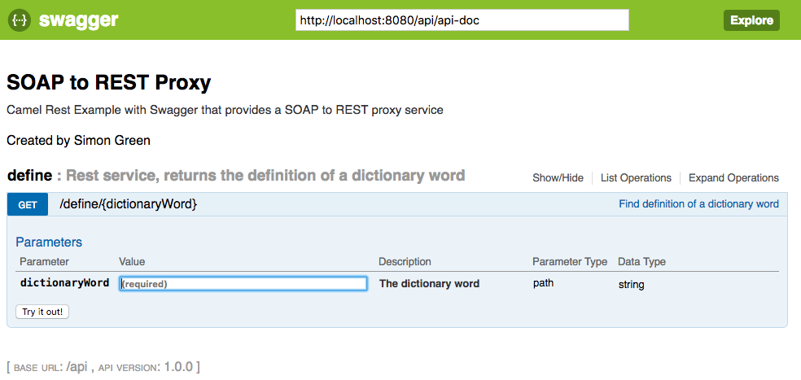

Notes on this fork of : Fuse Integration Services (FIS) SOAP to REST Proxy Demo
====================================

## Original Code Location (and credit)

https://github.com/sigreen/rest-soap-transformation

This guy saved my life!

# Overview

This version of the code uses the original globalweather.wsdl. The version I used as a base
used the DictService.wsdl, I believe because the globalweather soap site went dark or some such.
I modified back to global service as a proof of concept that I could build my own json->soap
service. Also, I added soapui to this version to act as the soap server.


## build


```
mvn clean install
mvn generate-sources
```

## run


* the http services runs on 8080
* the service also uses 8081 for management services, see application.properties
todo : what is it using 8081 for?


```
mvn spring-boot:run -Dspring.profiles.active=dev
```

## testing

Once the spring-boot:run is up and servicing, test the whole thing end to end

Because I'm mocking the soap service globalweather, soapui is required

Import project globalweather-soapui-project.xml into SOAPUI

start mock service. It exposes localhost:8082/mockweather soap service.

do a simple test. GetCitiesByCountry TestCase / Test Steps / GetCitiesByCountry

It should return soap message with 'none' for the reply (that is the default response for the mock service).
At this point you've set up a soap service, and verified that it works.

And finally, do the following in your browser (http://localhost:8080/camel/country/france), and it should
return json of item: "none". You can check the message log of your mock service to view the soap sent.


## install in jboss

todo : No instructions yet on how to install this into jboss
todo : Have not modified swagger code yet

## end of global weather section

I've left the original notes from the create below


Fuse Integration Services (FIS) SOAP to REST Proxy Demo
====================================

Demonstration of a SOAP to REST Proxy for an existing SOAP service, using Fuse Integration Services 2.0.  A video walkthrough demonstrating this project can be found [here](https://youtu.be/TLOLWMeobuU).

## Overview

This project demonstrates a microservices based project leveraging SpringBoot and Apache Camel to proxy an existing SOAP service with a new REST front-end service.  Additionally, the REST API is documented using Swagger.  The project makes use of camel-servlet component listening on port 8080 and configured using Spring Boot.

## Prerequisites

An OpenShift environment must be present for deployment to to a cloud environment.  For the purpose of testing, I prefer to use [Minishift](https://fabric8.io/guide/getStarted/minishift.html)

## Deployment

This project can be deployed using two methods:

* Standalone Spring-Boot container
* On an Openshift environment using Fuse Integration Services 2.0
# NOTES BJG

# run app
mvn spring-boot:run -Dspring.profiles.active=dev

# test in swagger
http://localhost:8080/index.html

# test in browser
http://localhost:8080/camel/define/maim


## Standalone Spring Boot Container

The standalone method takes advantage of the [Camel Spring Boot Plugin](http://camel.apache.org/spring-boot.html) to build and run the microservice.

Execute the following command from the root project directory:

```
mvn spring-boot:run -Dspring.profiles.active=dev
```

Once the spring boot service has started, you can test the REST API by executing the following command

```
curl http://localhost:8080/api/define/maim
```

The definition of the dictionary word from multiple dictionaries is returned in JSON format.  Try other words as needed.

Additionally, you can reach the REST API using the web browser by navigating to http://localhost:8080/api/define/maim.  It's also possible to navigate the REST service using the Swagger documentation [here](http://localhost:8080/index.html).

## Openshift / Minishift Deployment

First, create a new OpenShift project called *fis-soap-rest-proxy*

```
oc new-project fis-soap-rest-proxy --description="Fuse Integration Services SOAP to REST Proxy Demo" --display-name="SOAP REST Proxy"
```

Execute the following command which will execute the *ocp* profile that executes the `clean fabric8:deploy` maven goal:

```
mvn -P ocp
```

The fabric8 maven plugin will perform the following actions:

* Compiles and packages the Java artifact
* Creates the OpenShift API objects
* Starts a Source to Image (S2I) binary build using the previously packaged artifact
* Deploys the application using binary streams

## Swagger UI

A [Swagger User Interface](http://swagger.io/swagger-ui/) is available within the rest-soap-transformation application to view and invoke the available services. 

Select the hyperlink for the gateway application to launch the Swagger UI



The raw swagger definition can also be found at the context path `api/api-doc` 

## Command Line Testing

Using a command line, execute the following to query the definition service

```
curl -s http://$(oc get routes rest-soap-transformation --template='{{ .spec.host }}')/api/define/maim | python -m json.tool
```
	
A successful response will output the following

```
{
  "item": {
    "Word": "maim",
    "Definitions": {
      "Definition": [
        {
          "Word": "maim",
          "Dictionary": {
            "Id": "gcide",
            "Name": "The Collaborative International Dictionary of English v.0.44"
          },
          "WordDefinition": "Maim \\Maim\\, n. [Written in law language {maihem}, and   {mayhem}.] [OF. mehaing. See {Maim}, v.]   1. The privation of the use of a limb or member of the body,      by which one is rendered less able to defend himself or to      annoy his adversary.      [1913 Webster]   2. The privation of any necessary part; a crippling;      mutilation; injury; deprivation of something essential.      See {Mayhem}.      [1913 Webster]            Surely there is more cause to fear lest the want            there of be a maim than the use of it a blemish.                                                  --Hooker.      [1913 Webster]            A noble author esteems it to be a maim in history            that the acts of Parliament should not be recited.                                                  --Hayward.      [1913 Webster]"
        },
        {
          "Word": "maim",
          "Dictionary": {
            "Id": "gcide",
            "Name": "The Collaborative International Dictionary of English v.0.44"
          },
          "WordDefinition": "Maim \\Maim\\ (m[=a]m), v. t. [imp. & p. p. {Maimed} (m[=a]md);p.   pr. & vb. n. {Maiming}.] [OE. maimen, OF. mahaignier,   mehaignier, meshaignier, cf. It. magagnare, LL. mahemiare,   mahennare; perh. of Celtic origin; cf. Armor. mac'ha[~n]a to   mutilate, m[=a]c'ha to crowd, press; or cf. OHG. mang[=o]n to   lack, perh. akin to E. mangle to lacerate. Cf. {Mayhem}.]   1. To deprive of the use of a limb, so as to render a person      in fighting less able either to defend himself or to annoy      his adversary.      [1913 Webster]            By the ancient law of England he that maimed any man            whereby he lost any part of his body, was sentenced            to lose the like part.                --Blackstone.      [1913 Webster]   2. To mutilate; to cripple; to injure; to disable; to impair.      [1913 Webster]            My late maimed limbs lack wonted might. --Spenser.      [1913 Webster]            You maimed the jurisdiction of all bishops. --Shak.      [1913 Webster]   Syn: To mutilate; mangle; cripple.        [1913 Webster]"
        },
        {
          "Word": "maim",
          "Dictionary": {
            "Id": "wn",
            "Name": "WordNet (r) 2.0"
          },
          "WordDefinition": "maim     v : injure or wound seriously and leave permanent disfiguration         or mutilation; \"people were maimed by the explosion\""
        }
      ]
    }
  }
}
```
# rest-soap-transformation2
# rest-soap-transformation2
